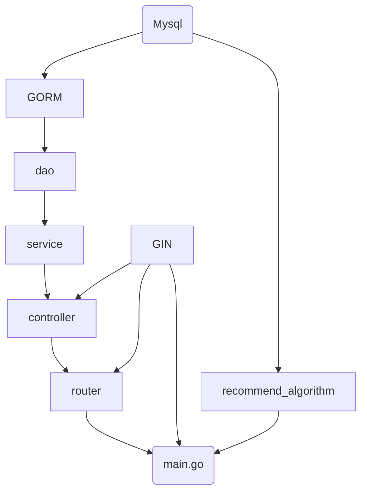

# music_website

## dist 包下为前端文件，目前该包下的文件是KTZ
## 完成了部分接口的对接

## 依赖关系

```mermaid
graph TD
GORM --> dao
dao --> service
service --> controller
controller --> router
router --> MAIN(main.go)
GIN --> controller
GIN --> router
GIN --> MAIN
recommend_algorithm --> MAIN
DB(Mysql) --> GORM
DB --> recommend_algorithm
```

